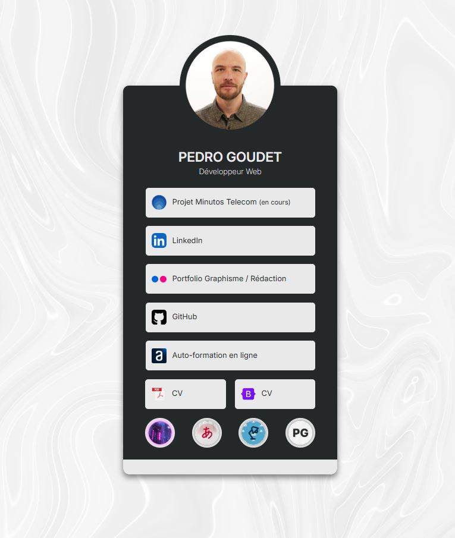

<h1 align="center">

🌳 Site Web de type Linktree

</h1>

# <a href="https://pmgoudet.vercel.app/assets/pages/minutos.html" target="_blank">🔗 Lien du Projet - GO!</a>

## 📣 Le Projet

Ce dépôt propose une version simplifiée d’une page personnelle de type Linktree, conçue pour servir de hub de liens. Il permet aux utilisateurs d’organiser et de partager plusieurs liens sur une seule page facilement accessible. Le projet inclut une photo de profil personnalisable et un design moderne et réactif, compatible avec différents appareils.

Un élément intéressant d'interaction avec l'utilisateur est que **chaque bouton au bas de la page peut modifier le style CSS de la page**.

## 🛠️ Installation

Pour exécuter cette page de profil en local ou y apporter des contributions, suivez ces étapes :

1. **Clonez le dépôt**

2. **Ouvrez le fichier `index.html`** dans votre navigateur web préféré.

## 🔧 **Technologies**
   

## 📄 License

Ce projet est sous licence [MIT License](LICENSE.md), ce qui signifie que vous êtes libre d'utiliser, de modifier et de distribuer le code.

---
#
---

<h1 align="center">

🌳 Linktree-like Website

</h1>

# <a href="https://pmgoudet.vercel.app/assets/pages/minutos.html" target="_blank">🔗 Project Link - GO!</a>

## 📣 The Project

This repository offers a simplified version of a Linktree-like personal page, designed to serve as a link hub. It allows users to organize and share multiple links on a single, easily accessible page. The project includes a customizable profile picture and a modern, responsive design, compatible with various devices.

An interesting user interaction feature is that **each button at the bottom of the page can modify the CSS style of the page**.

## 🛠️ Installation

To run this profile page locally or make contributions, follow these steps:

1. **Clone the repository**

2. **Open the `index.html` file** in your preferred web browser.

## 🔧 **Technologies**
   

## 📄 License

This project is licensed under the [MIT License](LICENSE.md), which means you are free to use, modify, and distribute the code.
